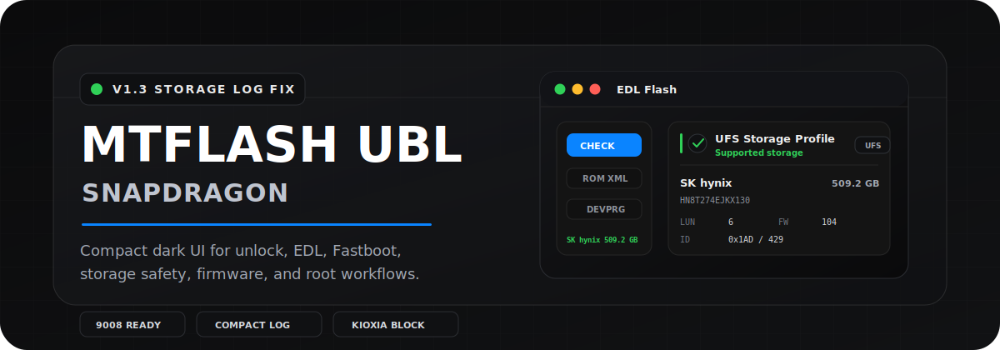

# MTFLASH UBL Snapdragon

<picture>
  <source media="(prefers-color-scheme: dark)" srcset="docs/readme/hero-v13-dark.svg">
  <source media="(prefers-color-scheme: light)" srcset="docs/readme/hero-v13-light.svg">
  
</picture>

  
  
  
  

  <a href="https://github.com/tamm2904/MTFLASH_UBL_SNAPDRAGON/releases/latest"><b>Download Latest Release</b></a>
  &nbsp;·&nbsp;
  <a href="#overview">Overview</a>
  &nbsp;·&nbsp;
  <a href="#release">Release</a>
  &nbsp;·&nbsp;
  <a href="#feature-map">Features</a>
  &nbsp;·&nbsp;
  <a href="#supported-devices">Devices</a>
  &nbsp;·&nbsp;
  <a href="#contact">Contact</a>

  <b>Professional Snapdragon servicing workspace for bootloader unlock, firmware handling, EDL/Fastboot flashing, storage safety, and root workflows.</b> 
  <b>Công cụ Windows chuyên nghiệp cho unlock bootloader, xử lý firmware, flash EDL/Fastboot, kiểm tra storage an toàn và root thiết bị Snapdragon.</b>

---

## Overview

MTFLASH UBL Snapdragon is a guided Windows tool for selected Xiaomi, Redmi, POCO, ZTE, Nubia, RedMagic, and ASUS Snapdragon devices. It combines model-aware checks, QR-based authorization, live logs, firmware download support, device-mode guidance, and safety gates for high-risk EDL workflows.

MTFLASH UBL Snapdragon là công cụ Windows có hướng dẫn cho một số thiết bị Snapdragon thuộc Xiaomi, Redmi, POCO, ZTE, Nubia, RedMagic và ASUS. Công cụ tập trung vào kiểm tra đúng model, xác thực QR, log trực tiếp, hỗ trợ firmware, hướng dẫn chuyển chế độ thiết bị và các lớp an toàn cho thao tác EDL rủi ro cao.

## Release

**Latest source version:** [MTFLASH UBL Tool v1.5](https://github.com/tamm2904/MTFLASH_UBL_SNAPDRAGON/releases/tag/v1.5)

- **Artifact:** `UBL-Snapdragon.exe`
- **Size:** `129,448,567` bytes
- **SHA256:** <code>001A7AD922166B8CC9BD51E721CE2EF4EEF7F8B18B44F9F8C4DAADD29CC<wbr>52558</code>

**v1.5 focus:** premium dark glassmorphism update gate, safer PyInstaller/Flet restart after update, faster segmented update downloads with SHA256 verification, compact premium sidebar navigation with a cleaner translucent neutral background and explicit menu trigger, hidden background update checks when no new release exists, version-aware downgrade protection, post-QR automatic Xiaomi USB/Qualcomm 9008 driver readiness, high-version Xiaomi 8G2/8E mini Eng EDL handling, Xiaomi 8SG4 Secure Unlock authorization with encrypted boot asset packaging, automatic 8SG4 Fastboot wait after `fastboot boot`, and the verified install/restart chain.

**Trọng tâm v1.5:** giao diện kiểm tra cập nhật glassmorphism dark premium, restart sau cập nhật an toàn hơn cho PyInstaller/Flet, tải cập nhật nhanh hơn bằng chia đoạn song song có xác minh SHA256, menu sidebar compact/premium với nền kính trung tính trong hơn và điểm mở rõ ràng, kiểm tra ngầm không hiện UI khi không có release mới, chặn hạ cấp theo version, tự kiểm tra/cài Xiaomi USB và Qualcomm 9008 driver sau QR, xử lý nhánh mini Eng EDL cho Xiaomi 8G2/8E bản cao, xác thực Secure Unlock riêng cho Xiaomi 8SG4 với boot asset được mã hóa, tự chờ 8SG4 quay lại Fastboot sau `fastboot boot`, giữ chuỗi cài/khởi động lại có xác minh.

**Auto-update:** before QR authorization, the frozen Windows app silently checks the latest GitHub Release. The update UI appears only when a non-older release with a different verified SHA256 is available; the downloaded file is verified, installed locally, and restarted automatically.

**Tự động cập nhật:** trước khi xác thực QR, bản Windows `.exe` kiểm tra GitHub Release mới nhất ở chế độ ngầm. UI cập nhật chỉ xuất hiện khi có release không cũ hơn và SHA256 khác file đang chạy; file tải về được xác minh, cài đè tại chỗ và tự khởi động lại.

## Feature Map

<b>English</b>

- **Guided unlock:** step-based bootloader unlock flows for supported Snapdragon models.
- **High-version Xiaomi:** Xiaomi 8 Gen 3 and 8s Gen 3 high-version paths for security patch `2026-02-01` and newer where mapped.
- **Firmware:** Mini EngFirmware, Full EngFirmware, China Fastboot, and China HyperTN download handling where available.
- **Xiaomi 8G2/8E high-version fallback:** mini EngFirmware EDL preconditioning with tool-bundled programmer, UFS vendor gate, FastbootD-to-Fastboot recovery, Step 2 skip, and Step 4 stop after unlock verification without misc wipe or reboot.
- **Xiaomi 8SG4 Secure Unlock:** one-time server grant, Android approver capability check, signed encrypted authorization blob, and encrypted boot asset packaging.
- **EDL Flash:** ROM/XML selection, partition filtering, progress tracking, logs, and post-step cleanup.
- **Storage safety:** full UFS info check with vendor, product, capacity, LUN, firmware, and serial parsing.
- **Fastboot Flash:** queue-based flash/erase/reboot workflows with validation and status tracking.
- **Unlock quick utilities:** redesigned two-zone unlock controls for Brand/Chip selection, ADB/Fastboot reboot targets, and elevated local driver installs.
- **Post-QR driver readiness:** after authorization, the app checks Xiaomi USB and Qualcomm 9008 driver-store entries and automatically installs any missing bundled driver package.
- **Premium sidebar:** compact dark glassmorphism navigation with a cleaner translucent neutral panel, refined header, clearer menu discovery, responsive spacing, restrained active state, and clipped-safe labels.
- **Verified resilient auto-update:** silent pre-QR release check; premium update gate only when needed, with version guard, SHA256 comparison, segmented parallel downloads when supported, single-stream fallback, PyInstaller-safe restart, local replacement, and automatic restart.
- **Root assistant:** supported Magisk, KernelSU, KernelSU Next, and SukiSU workflows for unlocked devices.
- **Authorization:** QR and short-code authorization through App_MTFLASH before protected workflows.

<b>Tiếng Việt</b>

- **Unlock có hướng dẫn:** quy trình unlock bootloader theo từng bước cho model Snapdragon được hỗ trợ.
- **Xiaomi high-version:** nhánh Xiaomi 8 Gen 3 và 8s Gen 3 cho security patch từ `2026-02-01` trở lên nếu model đã có mapping.
- **Firmware:** xử lý tải Mini EngFirmware, Full EngFirmware, China Fastboot và China HyperTN khi model có dữ liệu.
- **Fallback Xiaomi 8G2/8E bản cao:** tiền xử lý mini EngFirmware bằng EDL với programmer đóng gói trong tool, kiểm tra vendor UFS, tự chuyển FastbootD về Fastboot thường, bỏ qua bước 2, và dừng bước 4 sau khi verify unlock mà không wipe misc hoặc reboot.
- **EDL Flash:** chọn ROM/XML, lọc partition, theo dõi tiến trình, log và dọn dẹp sau thao tác.
- **Storage safety:** kiểm tra đầy đủ thông tin UFS gồm vendor, mã chip, dung lượng, LUN, firmware và serial.
- **Fastboot Flash:** flash/erase/reboot bằng queue, có kiểm tra hợp lệ và theo dõi trạng thái.
- **Tiện ích nhanh trong Unlock:** bố cục hai vùng mới cho chọn Brand/Chip, reboot ADB/Fastboot và cài driver local bằng quyền admin.
- **Xiaomi 8SG4 Secure Unlock:** grant một lần từ server, kiểm tra quyền Android approver, blob authorization mã hóa có chữ ký và đóng gói boot asset ở dạng encrypted.
- **Sẵn sàng driver sau QR:** sau khi xác thực, app kiểm tra Xiaomi USB và Qualcomm 9008 trong Driver Store, rồi tự động cài gói driver có sẵn nếu còn thiếu.
- **Sidebar premium:** menu điều hướng dark glassmorphism gọn hơn, nền kính trung tính trong hơn, header tinh gọn hơn, dễ nhận biết vị trí mở menu, spacing responsive, active state tiết chế và label không bị cắt/tràn.
- **Tự động cập nhật bền vững có xác minh:** kiểm tra release ngầm trước QR; chỉ hiện update gate premium khi cần, có chặn hạ cấp version, so sánh SHA256, tải chia đoạn song song khi server hỗ trợ, fallback tải một luồng, restart an toàn cho PyInstaller, thay thế file local và tự khởi động lại.
- **Root assistant:** hỗ trợ Magisk, KernelSU, KernelSU Next và SukiSU cho thiết bị đã unlock.
- **Authorization:** xác thực bằng QR hoặc mã ngắn qua App_MTFLASH trước khi dùng workflow bảo vệ.

## EDL Storage Safety

The EDL Flash screen includes a dedicated **Check Storage** action and also performs an automatic storage check before flashing. A confirmed Kioxia/Toshiba UFS result blocks the flash before any partition write starts.

Màn hình EDL Flash có nút **Kiểm tra Storage** riêng và cũng tự động kiểm tra storage trước khi flash. Nếu xác nhận UFS Kioxia/Toshiba, công cụ sẽ chặn flash trước khi bắt đầu ghi partition.

| Vendor | Manufacturer ID | Behavior |
|---|---:|---|
| Kioxia/Toshiba | `0x198` / `408` | Block EDL flash |
| Samsung | `0x1CE` / `462` | Allow when other checks pass |
| SK hynix | `0x1AD` / `429` | Allow when other checks pass |
| Micron | `0x12C` / `300` | Allow when other checks pass |
| WDC/SanDisk | `0x145` / `325` | Allow when other checks pass |

If Firehose returns incomplete storage data, the tool warns instead of guessing. Only a definitive Kioxia/Toshiba match blocks the flash.

Nếu Firehose trả dữ liệu storage không đầy đủ, công cụ sẽ cảnh báo thay vì đoán. Chỉ kết quả Kioxia/Toshiba rõ ràng mới bị chặn flash.

## Basic Workflow

1. Download `UBL-Snapdragon.exe` from the latest release.
2. Install the correct USB driver for the device, or use the unlock-screen **Drivers** dropdown for Xiaomi USB / Qualcomm 9008 packages.
3. Run the tool on Windows 10 or Windows 11; the app checks verified updates silently before QR authorization and shows the update gate only when a new release exists.
4. Authorize with App_MTFLASH by scanning the QR code or entering the short code.
5. Connect the device in the requested mode: Android, Fastboot, FastbootD, or EDL.
6. Select the correct brand, chip, and model, or use device detection when available.
7. Read the live log and follow each confirmation prompt before continuing.
8. Do not disconnect the device during unlock, flash, erase, firmware, root, or reboot operations.

## Safety Rules

| Rule | Why it matters |
|---|---|
| Match the exact model and codename. | Wrong firmware or layout can brick the device. |
| Back up data first. | Unlock, wipe, root, and flash operations can erase user data. |
| Keep cable, battery, and USB port stable. | Interrupted EDL/Fastboot operations can leave the device unbootable. |
| Do not bypass Kioxia/Toshiba blocking. | Unsupported Firehose writes are blocked intentionally. |
| Use authorized workflows only. | The tool is designed for devices and accounts with valid permission. |

## Requirements

- Windows 10 or Windows 11.
- Qualcomm / OEM USB drivers for ADB, Fastboot, FastbootD, and Qualcomm HS-USB QDLoader 9008.
- Internet access for authorization and online firmware options.
- Active App_MTFLASH account with permission for this product.
- Device battery and USB connection stable enough for servicing operations.

## Supported Devices

Support is model-specific. Always confirm the exact model, codename, chip family, storage variant, and security patch before running a workflow.

<b>Xiaomi / Redmi / POCO</b>

#### Snapdragon 8 Elite

- Xiaomi 15 (`dada`)
- Xiaomi 15 Pro (`haotian`)
- Xiaomi 15 Ultra (`xuanyuan`)
- Redmi K80 Pro (`miro`)
- Redmi K90 (`annibale`)
- POCO F8 Pro (`annibale`)
- MIX Flip 2 (`bixi`)
- Pad 8 Pro (`piano`)

#### Snapdragon 8 Elite Gen 5

- Xiaomi 17 (`pudding`)
- Xiaomi 17 Pro (`pandora`)
- Xiaomi 17 Pro Max (`popsicle`)
- Xiaomi 17 Ultra (`nezha`)
- REDMI K90 Pro Max (`myron`)

#### Snapdragon 8 Gen 2

- Xiaomi 13 (`fuxi`)
- Xiaomi 13 Pro (`nuwa`)
- Xiaomi 13 Ultra (`ishtar`)
- Xiaomi MIX Fold 3 (`babylon`)
- Redmi K60 Pro (`socrates`)
- Redmi K70 (`vermeer`)
- POCO F6 Pro (`vermeer`)
- Xiaomi Pad 6S Pro (`sheng`)

#### Snapdragon 8 Gen 3

- Xiaomi 14 (`houji`)
- Xiaomi 14 Pro (`shennong`)
- Xiaomi 14 Ultra (`aurora`)
- Redmi K70 Pro (`manet`)
- Redmi K80 (`zorn`)
- MIX Flip (`ruyi`)
- MIX Fold 4 (`goku`)

#### Snapdragon 8s Gen 3

- Xiaomi Civi 4 Pro / 14 Civi (`chenfeng`)
- POCO F6 / Redmi Turbo 3 (`peridot`)
- Xiaomi Pad 7 Pro (`muyu`)
- Xiaomi Pad 7 (`uke`)

#### Snapdragon 8s Gen 4

- Xiaomi Civi 5 Pro (`luming`)
- Xiaomi Pad 8 (`yupei`)
- Redmi Turbo 4 Pro / POCO F7 (`onyx`)

<b>ZTE / Nubia / RedMagic</b>

#### Snapdragon 8 Elite

- RedMagic 10 Series (`NX789J`)
- RedMagic 11 Air (`NX799J`)
- RedMagic Pad 3 Pro / Astra (`NP05J`, `PQ84P01`)
- Nubia Z70 Ultra (`NX733J`)
- Nubia Z70 Ultra (`NX736J`)

#### Snapdragon 8 Elite Gen 5

- RedMagic 11 Series (`NX809J`)
- Nubia Z80 Ultra (`NX741J`)

<b>ASUS ROG</b>

#### Snapdragon 8 Elite

- ROG Phone 9 / 9 Pro (`AI2501`)
- ROG Phone 9 Global (`ASUS_AI2501_A`)
- ROG Phone 9 JP/TW (`ASUS_AI2501_B`)
- ROG Phone 9 Pro WW (`ASUS_AI2501_C`)
- ROG Phone 9 Pro US (`ASUS_AI2501_D`)
- ROG Phone 9 Pro Edition US (`ASUS_AI2501_E`)
- ROG Phone 9 Pro JP/TW (`ASUS_AI2501_F`)

## Authorization

| English | Tiếng Việt |
|---|---|
| The tool requires an active App_MTFLASH account with permission for this product. | Công cụ cần tài khoản App_MTFLASH còn hiệu lực và có quyền sử dụng sản phẩm này. |
| Scan the QR code or enter the short code shown in the Windows app. | Quét mã QR hoặc nhập mã ngắn hiển thị trong ứng dụng Windows. |
| Device workflows are available only after authorization is approved. | Chỉ có thể dùng workflow thiết bị sau khi xác thực được chấp thuận. |
| Internet access to the MTFLASH/APMPro service is required. | Cần internet để kết nối dịch vụ MTFLASH/APMPro. |

## Contact

| Channel | Link |
|---|---|
| Website | [mtflash.com](https://mtflash.com) |
| Contact page | [mtflash.com/lien-he.html](https://mtflash.com/lien-he.html) |
| Firmware portal | [file.mtflash.com](https://file.mtflash.com) |
| Email | [support@mtflash.com](mailto:support@mtflash.com) |
| Phone / Zalo | [0975904043](https://zalo.me/0975904043) |
| WhatsApp | [+84 975 904 043](https://wa.me/84975904043) |
| Telegram | [@bunnyVN888](https://t.me/bunnyVN888) |
| Facebook | [facebook.com/play29.mt](https://www.facebook.com/play29.mt) |
| YouTube | [youtube.com/@phoneauth](https://youtube.com/@phoneauth?si=2-qHa6n4kbLMeBG5) |

---

  <b>MTFLASH UBL Snapdragon</b> 
  Compact, model-aware, safety-first Snapdragon servicing for authorized users.

